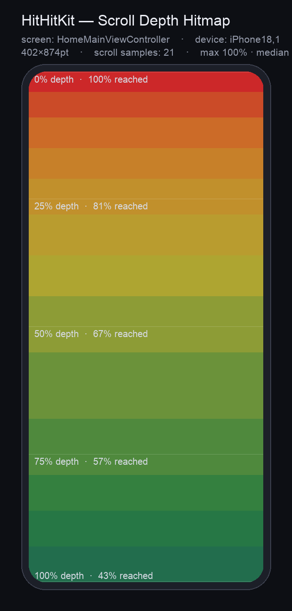
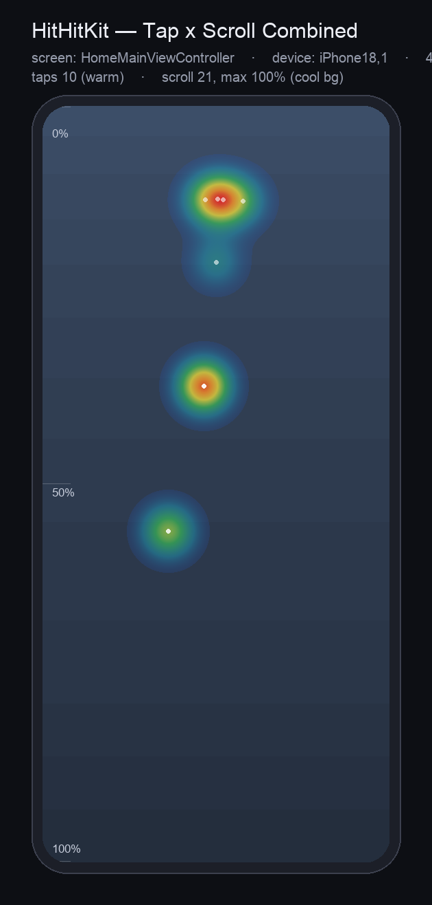
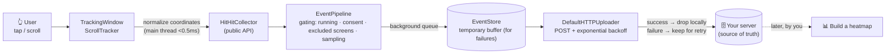
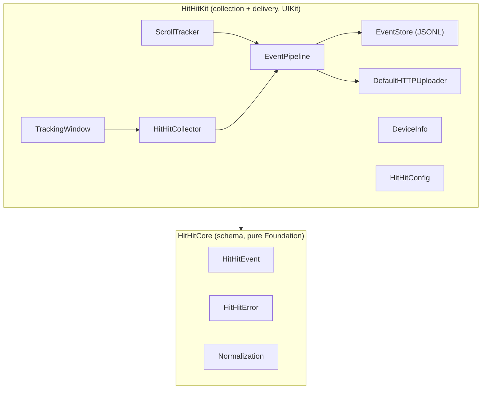

# HitHitKit

[](https://github.com/DevVenusK/iOS-HitHit/actions/workflows/ci.yml)


A 1st-party UX analytics SDK that **collects tap and scroll events from a host iOS app as
device-independent normalized coordinates and ships them straight to your own server**.
**It does not render heatmaps** — you build those yourself, later, from the data it collects.

---

## 🎯 Why this exists

> We want to know where users tap on a screen, and how far down they actually scroll.

Commercial analytics SDKs (UXCam, Smartlook, and friends) are convenient, but they create two
problems for a financial app:

1. **Data sovereignty** — the raw record of user interaction leaves for a third-party vendor.
2. **Privacy control** — it is hard to say precisely what may and may not be captured.

HitHitKit owns **only the collection layer**. It gathers the minimum — coordinates, a screen
name, a timestamp — sends it to **your server**, and leaves visualization to whatever tool you
prefer.

**Design principles**

- **Collection only** — rendering and viewers are out of scope (Non-Goal)
- **Coordinates only** — no text, no input values, no element identifiers → the PII path is removed at the source
- **Consent defaults to OFF** — not a single event is collected before explicit opt-in (fail-safe, enforced by a regression test)
- **Zero third-party dependencies** — nothing to conflict with the host app's versions
- **Performance budget** — under 0.5 ms on the main thread per touch (measured ≈0.15 µs per op)
- **Device independent** — 0–1 normalization plus the screen size that produced it, so an SE and a Pro Max can be pooled without losing meaning

---

## 📸 What you can build from the data

> ⚠️ **The SDK does not draw these.** HitHitKit collects coordinates, depth, and time, and sends
> them to your server (rendering is a Non-Goal). These are examples of what those events look
> like once **you** visualize them. For the server-side render pipeline, see
> [docs/architecture.html](docs/architecture.html).

| Scroll depth | Tap × scroll, overlaid |
|:--:|:--:|
|  |  |
| **Share of users who reached each depth.** Everyone sees the top (0%), but only **43%** ever reach the bottom (100%) — more than half the audience never sees the lower content | Warm blobs = **where taps cluster**; cool background = scroll depth. "Where do they tap" and "how far do they look" on a single canvas |

Both images were rendered from **sample data** for one screen
(`screen: HomeMainViewController` · `iPhone18,1` 402×874pt) with **10 taps / 21 scroll samples**.
The data and the exact commands to reproduce them live in [docs/samples/](docs/samples/)
(same input → byte-identical PNG).

Because `x`, `y`, and `scrollDepth` are normalized to 0–1 and every event carries
`screenW`/`screenH`, `device`, and `orientation`, **data from a mix of devices can be pooled into
one picture.**

---

## 🧩 Architecture

### Data flow



### Module dependencies



- **HitHitCore** — pure logic with no UIKit dependency (schema, errors, coordinate normalization). Unit-testable anywhere.
- **HitHitKit** — the UIKit glue plus collection, storage, and delivery. The public surface is narrowed to a single type, `HitHitCollector`.
- Gating, storage, and upload live in `EventPipeline` (constructor-injected) so they can be tested in isolation; the singleton is a thin façade over it.

---

## 📁 Repository layout

```
iOS-HitHit/
├── Package.swift                 # SwiftPM: 2 targets — HitHitCore + HitHitKit
├── Sources/
│   ├── HitHitCore/              # schema · errors · normalization · tap classification (pure)
│   │   ├── HitHitEvent.swift
│   │   ├── HitHitError.swift    #   struct + code (safe to extend)
│   │   ├── Normalization.swift   #   pure coordinate / scroll-depth functions
│   │   └── TouchClassifier.swift #   tap vs. scroll decision (pure)
│   └── HitHitKit/               # collection + delivery (UIKit)
│       ├── HitHitCollector.swift #  public entry point
│       ├── HitHitConfig.swift
│       ├── HitHitUploader.swift  #  protocol + built-in HTTP uploader
│       ├── EventPipeline.swift    #  gating/storage/upload core (testable)
│       ├── EventStore.swift       #  JSONL batch buffer
│       ├── CollectionGate.swift   #  "may we collect this?" decision (pure)
│       ├── BufferPolicy.swift     #  "how much to drop on overflow?" decision (pure)
│       ├── TrackingWindow.swift   #  global tap interception
│       ├── ScrollTracker.swift    #  scroll-depth sampling (no swizzling)
│       └── DeviceInfo.swift
├── Tests/                        # Swift Testing — 55 on macOS + 16 iOS-only (UIKit glue)
├── docs/
│   ├── sdk-spec/                 # technical spec (the v1 collection spec is authoritative)
│   ├── images/                   # example heatmaps used by this README
│   ├── samples/                  # the sample events behind those images + repro commands
│   └── po/                       # product backlog (RICE) + team consultation replies
└── .github/workflows/ci.yml      # SwiftPM test + iOS simulator test
```

---

## 📦 What gets collected (the event that reaches your server)

Taps and scrolls share one flat schema. Every event carries `screenW`/`screenH`, `device`, and
`orientation` so that any mix of devices can be combined into a single heatmap.

```json
// tap
{ "schemaVersion": 1, "id": "9F2A…", "type": "tap", "screen": "loan_detail",
  "x": 0.42, "y": 0.73, "screenW": 390, "screenH": 844,
  "device": "iPhone15,3", "orientation": "portrait", "ts": 1719800000000 }

// scroll
{ "schemaVersion": 1, "id": "1C7B…", "type": "scroll", "screen": "loan_detail",
  "scrollDepth": 0.65, "scrollOffsetY": 1240,
  "screenW": 390, "screenH": 844,
  "device": "iPhone15,3", "orientation": "portrait", "ts": 1719800000000 }
```

| Field | Meaning |
|---|---|
| `id` | Event UUID — lets the server **deduplicate idempotently** when an ACK is lost and the batch is retried |
| `type` | `tap` \| `scroll`. A tap is a touch that went down and came back up **without moving much** (travel ≤ `TrackingWindow.tapSlop`, 10pt by default), so scrolls and drags are never misread as taps |
| `screen` | Screen name (free-form string). Map it to something meaningful later. **Must not contain PII** |
| `x`, `y` | Tap position normalized to 0–1 (relative to the window bounds) |
| `scrollDepth` | Scroll depth normalized to 0–1 |
| `screenW`, `screenH`, `device`, `orientation` | The normalization basis plus device context |
| `ts` | Epoch milliseconds |

---

## 🚀 Quick Start

```swift
// Package.swift
dependencies: [
    .package(url: "https://github.com/DevVenusK/iOS-HitHit.git", from: "0.0.1")
]
```

```swift
// 1) SceneDelegate — swap your window for a TrackingWindow
window = TrackingWindow(windowScene: windowScene)

// 2) At app start
let config = HitHitConfig(endpoint: URL(string: "https://your.server/hitmap")!)
try? HitHitCollector.shared.start(config: config)

// 3) Once you have consent (OFF by default)
HitHitCollector.shared.setConsent(true)
```

Per screen:

```swift
HitHitCollector.shared.setScreen("loan_detail")   // current screen name
// Scroll views are tracked automatically, so usually there is nothing to do here.
// (Set autoTrackScrollViews = false to register only the ones you pick, via track(scrollView:))
HitHitCollector.shared.flush()                    // when entering the background
```

> **Scroll tracking is automatic by default.** When a touch begins inside a scroll view, that
> scroll view is registered for you — no swizzling involved. It works without setup, just like
> taps. If you need finer control, set `config.autoTrackScrollViews = false` and register views
> explicitly with `track(scrollView:)`.

---

## ⚙️ Configuration (`HitHitConfig`)

| Field | Default | Description |
|---|---|---|
| `endpoint` | (required) | **Server URL that receives the collected data.** This server is the source of truth |
| `headers` | `[:]` | Request headers, e.g. authentication |
| `excludedScreens` | `[]` | Screens to skip entirely (sensitive screens) |
| `samplingRate` | `1.0` | Probabilistic sampling, 0–1 |
| `scrollSampleHz` | `10` | Scroll sampling frequency |
| `autoTrackScrollViews` | `true` | Auto-register the touched scroll view. When false, only views passed to `track(scrollView:)` are tracked |
| `uploadStrategy` | `.immediate` | Delivery strategy (see below) |
| `storageDirectory` | caches | Location of the **temporary buffer** used for failures and offline periods |
| `maxBufferedEvents` | `20000` | Cap on buffered events. Beyond it, the **oldest are dropped** (0 or less = unlimited) |
| `uploader` | nil | Custom uploader; injecting one replaces the built-in |

### Upload strategy

**The server is the source of truth.** The local JSONL file is not durable storage — it is a
**temporary buffer for delivery failures and offline periods**, and it is emptied as soon as an
upload succeeds.

| Strategy | Behavior |
|---|---|
| **`.immediate`** (default) | Send **as soon as an event occurs**. Events that arrive while a request is in flight are coalesced into the next drain, so a burst of taps does not turn into one request per tap. Only undelivered events sit locally, and only briefly |
| `.batched(maxSize:interval:)` | Send when the buffer reaches `maxSize` or `interval` elapses. Easier on network and battery, at the cost of events resting locally for longer |

```swift
var config = HitHitConfig(endpoint: serverURL)
config.uploadStrategy = .immediate                        // default: send right away
// config.uploadStrategy = .batched(maxSize: 500, interval: 30)  // frugal mode
```

> On failure or offline, events stay in the local buffer and are retried by a 60-second sweep, or
> on the next event, or on `flush()`.

> **Buffer cap.** So that a long offline stretch cannot grow the file without bound, anything past
> `maxBufferedEvents` (20,000 by default) is discarded **oldest-first**. Each trim goes down to 90%
> of the cap to amortize the cost of rewriting the file, and a batch that is currently being
> uploaded is left untouched so its line alignment cannot drift.

Custom uploader:

```swift
final class MyUploader: HitHitUploader {
    func upload(batch: Data, completion: @escaping (Result<Void, Error>) -> Void) { /* ... */ }
}
config.uploader = MyUploader()
```

---

## 🔒 Privacy

- **Consent is the master switch and defaults to OFF** — nothing is collected or stored before
  `setConsent(true)` (enforced by a regression test). If your legal basis means coordinate
  collection needs no separate opt-in, simply call `setConsent(true)` once at startup; the SDK
  does not force a consent UI on you.
- **Revoking consent** (`setConsent(false)`) stops new collection **and halts uploads of anything
  still buffered** (both resume if consent is granted again). To delete outright, call
  `purgePendingEvents()`.
- **Coordinates only** — content, input values, and element identifiers are never collected.
- **Exclude sensitive screens** — register login, account, and amount screens in
  `excludedScreens` (exact string match).
- **Keep PII out of `screen` names** — they are transmitted, so use stable symbolic names.
- **This is not ATT/IDFA tracking** (it is 1st-party analytics). A privacy manifest is not
  strictly required today because no required-reason APIs are used; declaring the data collection
  is handled by the host app's App Privacy labels →
  [details](docs/sdk-spec/hithitkit-v1-collection.md) §6

## ⚠️ Known limitations

- **Multiple scenes / windows (iPad multi-window)**: `HitHitCollector.shared` keeps a single
  global `currentScreen`, so if several scenes display different screens at once, the labels can
  interleave. Single-scene apps — most phone apps — are unaffected. Per-scene state is future work.
- **The local buffer is not encrypted**: the temporary JSONL sits in caches as plain text and is
  deleted once delivered. In sensitive environments, point `storageDirectory` at a protected
  location or apply File Protection.
- **Hosts without `TrackingWindow`**: if you do not install `TrackingWindow`, taps are simply not
  collected (DEBUG builds print a warning).
- **The `UITouch` sequence itself cannot be unit-tested**: `UITouch` and `UIEvent` cannot be
  constructed, so the `sendEvent` path is out of reach for unit tests. The tap **decision rule**
  is extracted into `TouchClassifier` and tested there, while coordinate normalization and
  automatic scroll registration are covered by simulator tests.

---

## 🧪 Development / Testing

```bash
swift build
swift test        # macOS host: 55 tests (Swift Testing)
                  # consent-OFF gate · upload retries · normalization · storage · buffer cap · perf budget
```

> ⚠️ **On macOS, `canImport(UIKit)` is false**, so `HitHitCollector`, `TrackingWindow`, and
> `ScrollTracker` are excluded from compilation entirely. `swift test` alone therefore does **not**
> verify the UIKit glue. Tap coordinate normalization, scroll sampling, and weak untracking run
> **only in the simulator**:

```bash
UDID=$(xcrun simctl list devices available \
  | awk -F'[()]' '/iPhone/ {gsub(/ /,"",$2); print $2; exit}')
xcodebuild test -scheme HitHitKit-Package -destination "id=$UDID" CODE_SIGNING_ALLOWED=NO
# → 71 tests (55 from macOS + 16 UIKit glue)
```

- The `HitHitKit` scheme does not support the test action (it is a library product), so use **`HitHitKit-Package`**
- Performance guard: a hard assertion that the main-thread intake path stays under 0.5 ms per op
- Toolchain: Swift Testing requires **Swift 6.0+** (on Xcode 15.4 / Swift 5.10 you get `no such module 'Testing'`)
- CI: `swift test` on a macOS runner **plus `xcodebuild test` on an iOS simulator** to cover the UIKit glue

---

## 🗺️ Status / Roadmap

| Stage | Item | Status |
|---|---|---|
| **NOW (0.x)** | Collection core · consent gate · direct delivery · performance budget · CI · README | ✅ Done |
| NOW-EXIT | Freeze wire schema v1 (one review pass with analysts) | ⏳ Awaiting workshop |
| NEXT | Reference uploader sample · optional `sessionID` field, if needed | Planned |
| LATER | CocoaPods podspec · SQLite storage option | Conditional |

> **Versioning**: the wire schema may still change during pre-1.0 (0.x). Once it is frozen, the
> package is promoted to `v1.0.0`. Prioritization rationale lives in
> [docs/po/hithitkit-backlog.md](docs/po/hithitkit-backlog.md) (RICE).

---

## 📚 Documentation

> These documents are written in Korean.

| Document | Contents |
|---|---|
| [docs/sdk-spec/hithitkit-v1-collection.md](docs/sdk-spec/hithitkit-v1-collection.md) | **v1 collection spec (authoritative)** — API, schema, delivery, privacy |
| [docs/sdk-spec/hithitkit.md](docs/sdk-spec/hithitkit.md) | The original full-scope spec, including a renderer (superseded by v1) |
| [docs/po/hithitkit-backlog.md](docs/po/hithitkit-backlog.md) | Product backlog, RICE prioritization, roadmap |
| [docs/po/consults/](docs/po/consults/) | Replies from the iOS, design, and security team consultations |
| [docs/samples/](docs/samples/) | Sample events behind the README images + reproduction commands |

---

## License

Proprietary — Finda 1st-party.
